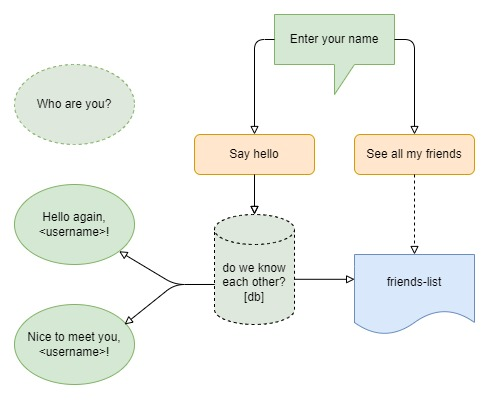

# Second task for EVO Python Lab 2022 #

This is a simple app that greets users by name and remembers them.

- [FastAPI](https://fastapi.tiangolo.com/) is used as a server cuz this is simple and quick python framework.
- [Uvicorn](https://www.uvicorn.org/) as main ASGI server.
- [MongoDB Atlas](https://www.mongodb.com/atlas) as fast NoSQL cloud service.
- Production deployed on [Heroku](https://heroku.com).

### INSTALLATION ###
___
    python -m venv env
    . ./env/bin/activate
    pip install -r requirements.txt
    uvicorn main:app

U can see deployed app [here](https://hello-my-friend.herokuapp.com/).
